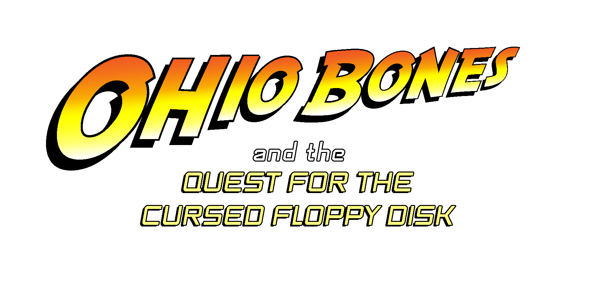

# OhioBonesExperience
A VR application that our group TECHMINATORS implement for the coure of "M110 Interactive Systems" at Kapodistrian University of Athens.

<!-- Improved compatibility of back to top link: See: https://github.com/othneildrew/Best-README-Template/pull/73 -->

<!--
*** Thanks for checking out the Best-README-Template. If you have a suggestion
*** that would make this better, please fork the repo and create a pull request
*** or simply open an issue with the tag "enhancement".
*** Don't forget to give the project a star!
*** Thanks again! Now go create something AMAZING! :D
-->

<!-- PROJECT SHIELDS -->
<!--
*** I'm using markdown "reference style" links for readability.
*** Reference links are enclosed in brackets [ ] instead of parentheses ( ).
*** See the bottom of this document for the declaration of the reference variables
*** for contributors-url, forks-url, etc. This is an optional, concise syntax you may use.
*** https://www.markdownguide.org/basic-syntax/#reference-style-links
-->

<!-- PROJECT LOGO -->
 

  

<!-- TABLE OF CONTENTS -->

  
Table of Contents

  <ol>
    <li><a href="#about-the-project">About The Project</a></li>
    <li><a href="#contact">Contact</a></li>
    <li><a href="#contribution">Contribution</a></li>
    <li><a href="#assets">Assets</a></li>
  </ol>

<!-- ABOUT THE PROJECT -->
## About The Project

Ohio Bones, a young detective, hears strange rumors about the Computer Museum. It is said that something unusual is happening there. Some claim to see things moving on their own, others talk about disappearing visitors and old objects that seem to activate in strange ways. 
An inexplicable curiosity leads Ohio to the decision to visit it and shed light on the unsolved mysteries of the museum. Entering the museum, he sees old technology devices (computers, game consoles and other items from the past).
His goal is to solve the puzzles, collect items inside the museum and fight an unexpected enemy on an unexpected world. 
Will he be able to find the solution?

Our project is a Virtual Reallity experience that mixes ideas from escape rooms and defeating opponents concepts. 
The inspiration for aeshtetics comes from a variety of games such as Zelda (ping pong style mechanic), Digimon and Fallout Franchise. Α space with a sense of mystery and a room with mechanical objects were required for this result.

(<a href="#readme-top">back to top</a>)

### Built With

Unity and C#, 3D objects implemented with Blender.

*   
  
*  
  
* 

(<a href="#readme-top">back to top</a>)

<!-- CONTACT -->
## Contact

Your Name   : projectopoulos.m110@gmail.com

Project Link: <a href="https://www.blender.org/">
    /ohiobonesexperience
  </a>

(<a href="#readme-top">back to top</a>)

<!-- CONTRIBUTION -->
## Contribution

TechnminatorS Group Members

* Gkoumas Vasilis
* Katopodis Odysseas
* Natsi Dimitra
* Papageorgiou Kostas
* Chelvatzi Dimitra

(<a href="#readme-top">back to top</a>)

<!-- ASSETS -->
## Assets

* [Assets list](https://drive.google.com/drive/folders/100Z9LEmEKphYK6rbCum78T7-GMr5jQME)

(<a href="#readme-top">back to top</a>)
  

